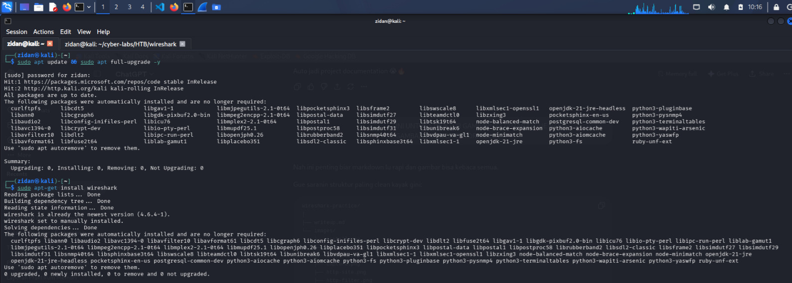
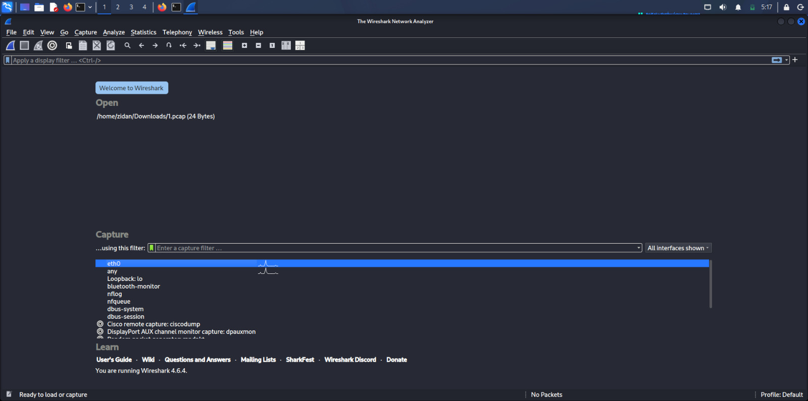
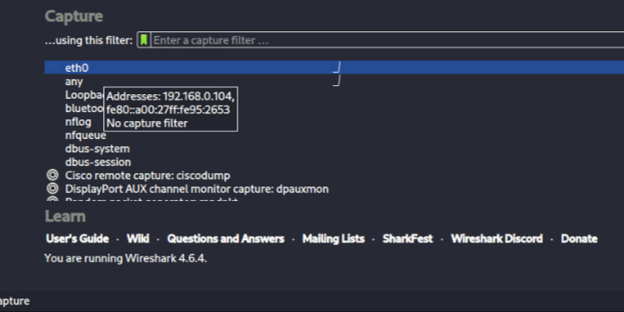
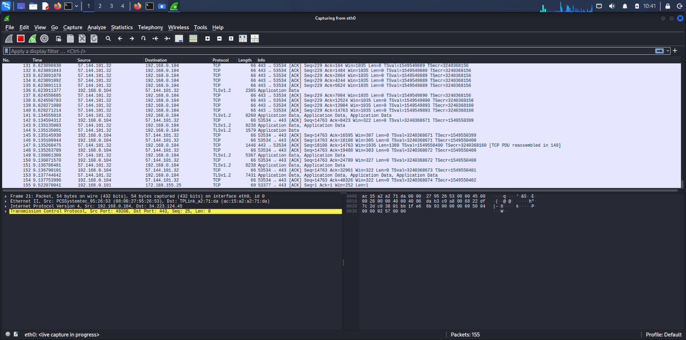
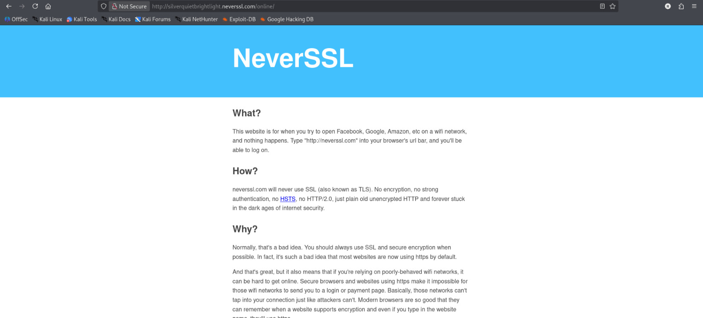
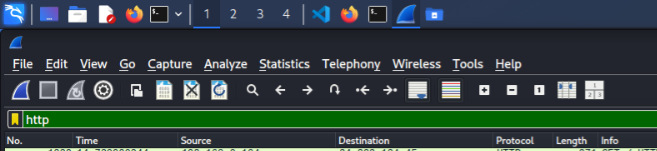
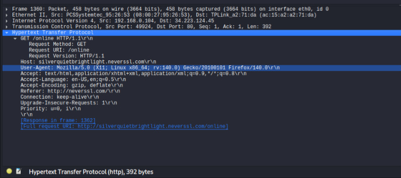
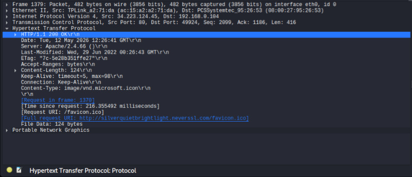

#  Wireshark Practice — HTTP GET/POST Observation

> **Praktik mandiri** observasi traffic jaringan menggunakan Wireshark untuk memahami proses komunikasi HTTP antara client dan server.

---

## 📋 Table of Contents

- [Environment](#environment)
- [Installation](#installation)
- [Running Wireshark](#running-wireshark)
- [Selecting Interface](#selecting-interface)
- [Starting Packet Capture](#starting-packet-capture)
- [HTTP Traffic Observation](#http-traffic-observation)
- [Filtering HTTP Packets](#filtering-http-packets)
- [HTTP GET Request Analysis](#http-get-request-analysis)
- [HTTP Response Analysis](#http-response-analysis)
- [Key Findings](#key-findings)
- [Filters Reference](#filters-reference)
- [Conclusion](#conclusion)
- [References](#references)

---

## Environment

| Komponen  | Detail      |
|-----------|-------------|
| OS        | Kali Linux  |
| Tools     | Wireshark   |
| Browser   | Firefox     |
| Interface | eth0        |

---

## Installation

Install Wireshark menggunakan `apt`:

```bash
sudo apt update
sudo apt install wireshark -y
```

> **Note:** Saat proses instalasi, akan muncul dialog yang menanyakan apakah non-root user diizinkan untuk melakukan packet capture. Pilih `Yes` agar Wireshark dapat dijalankan tanpa `sudo`.

### Screenshot


---

## Running Wireshark

Jalankan Wireshark melalui terminal:

```bash
wireshark
```

Atau bisa juga melalui Application Menu di Kali Linux → `Sniffing & Spoofing` → `Wireshark`.

### Screenshot


---

## Selecting Interface

Interface `eth0` dipilih karena merupakan interface aktif yang digunakan untuk koneksi internet pada environment ini.

> **Tip:** Interface yang aktif biasanya ditandai dengan adanya grafik aktivitas jaringan di sebelah namanya pada tampilan awal Wireshark.

### Screenshot


---

## Starting Packet Capture

Capture dimulai dengan melakukan **double click** pada interface `eth0`.

Wireshark akan langsung mulai merekam semua packet yang melewati interface tersebut secara real-time.

### Screenshot


---

## HTTP Traffic Observation

Website HTTP (non-HTTPS) digunakan agar traffic dapat dibaca tanpa enkripsi, sehingga isi packet bisa dianalisis secara langsung.

Website yang digunakan:

```
http://neverssl.com
```

> **Mengapa HTTP?** HTTPS mengenkripsi payload menggunakan TLS, sehingga isi data tidak bisa dibaca langsung di Wireshark tanpa private key server. HTTP mengirimkan data secara plaintext, cocok untuk tujuan pembelajaran.

### Screenshot


---

## Filtering HTTP Packets

Untuk memfokuskan tampilan hanya pada traffic HTTP, gunakan filter berikut di kolom filter Wireshark:

```wireshark
http
```

Filter ini akan menyembunyikan packet lain (TCP, DNS, ARP, dll.) dan hanya menampilkan packet yang menggunakan protokol HTTP.

### Screenshot


---

## HTTP GET Request Analysis

Setelah mengakses `http://neverssl.com`, packet berikut berhasil diamati:

```http
GET / HTTP/1.1
Host: silverquietbrightlight.neverssl.com
User-Agent: Mozilla/5.0 (X11; Linux x86_64; rv:...) Gecko/... Firefox/...
Accept: text/html,application/xhtml+xml,application/xml;q=0.9,*/*;q=0.8
Accept-Language: en-US,en;q=0.5
Connection: keep-alive
```

### Breakdown Informasi

| Field        | Nilai                                    |
|--------------|------------------------------------------|
| Method       | `GET`                                    |
| Path         | `/`                                      |
| HTTP Version | `HTTP/1.1`                               |
| Host         | `silverquietbrightlight.neverssl.com`    |
| User-Agent   | Firefox Browser (Kali Linux)             |

> **GET vs POST:** Method `GET` digunakan untuk meminta/mengambil resource dari server. Method `POST` digunakan untuk mengirimkan data ke server (misalnya form login). Pada praktik ini, browser secara otomatis mengirimkan `GET` saat mengakses URL.

### Screenshot


---

## HTTP Response Analysis

Server memberikan response terhadap request `GET` yang dikirimkan:

```http
HTTP/1.1 200 OK
Content-Type: text/html; charset=UTF-8
Content-Length: ...
```

### HTTP Status Code

| Kode | Arti                       |
|------|----------------------------|
| 200  | OK — Request berhasil      |
| 301  | Moved Permanently (Redirect) |
| 404  | Not Found                  |
| 500  | Internal Server Error      |

Response `200 OK` menunjukkan bahwa server berhasil memproses request dan mengirimkan konten HTML kembali ke browser.

### Screenshot


---

## Key Findings

Dari praktik ini dapat dipahami bahwa:

- **Client-Server Model:** Browser bertindak sebagai client yang mengirimkan HTTP request, dan server merespons dengan data yang diminta.
- **HTTP Plaintext:** Traffic HTTP dapat dibaca secara langsung tanpa dekripsi, berbeda dengan HTTPS yang menggunakan enkripsi TLS.
- **Wireshark sebagai Network Analyzer:** Wireshark mampu menangkap dan menampilkan detail lengkap setiap packet yang melewati interface jaringan secara real-time.
- **HTTP Methods:** Method `GET` digunakan browser secara default saat mengakses URL di address bar.
- **Status Code:** Response code `200 OK` mengindikasikan komunikasi antara client dan server berjalan dengan sukses.

---

## Filters Reference

Berikut kumpulan filter Wireshark yang digunakan dan berguna untuk analisis HTTP:

| Filter                             | Fungsi                                      |
|------------------------------------|---------------------------------------------|
| `http`                             | Tampilkan semua traffic HTTP                |
| `http.request.method == "GET"`     | Filter hanya HTTP GET request               |
| `http.request.method == "POST"`    | Filter hanya HTTP POST request              |
| `http.response.code == 200`        | Filter response dengan status 200 OK        |
| `ip.addr == <IP>`                  | Filter traffic dari/ke IP tertentu          |
| `tcp.port == 80`                   | Filter traffic pada port 80 (HTTP)          |

---

## Conclusion

Praktik mandiri ini berhasil mendemonstrasikan proses komunikasi HTTP antara client (browser) dan server menggunakan Wireshark sebagai network packet analyzer.

Dengan menggunakan website `http://neverssl.com` yang tidak menggunakan enkripsi, seluruh isi packet HTTP — mulai dari request method, header, hingga response status — dapat diamati secara langsung. Hal ini memperjelas perbedaan mendasar antara HTTP dan HTTPS, serta pentingnya enkripsi dalam komunikasi jaringan modern.

Wireshark terbukti menjadi tools yang powerful untuk memahami cara kerja protokol jaringan pada level packet, dan sangat berguna untuk keperluan network analysis maupun troubleshooting.

---

## References

- [Wireshark Official Documentation](https://www.wireshark.org/docs/)
- [NeverSSL — HTTP Test Website](http://neverssl.com)
- [HTTP/1.1 Specification — RFC 7230](https://datatracker.ietf.org/doc/html/rfc7230)
- [HTTP Request Methods — MDN Web Docs](https://developer.mozilla.org/en-US/docs/Web/HTTP/Methods)
- [HTTP Response Status Codes — MDN Web Docs](https://developer.mozilla.org/en-US/docs/Web/HTTP/Status)
- [Kali Linux — Official Site](https://www.kali.org/)

---

*Praktik mandiri — Wireshark HTTP Observation | Kali Linux*